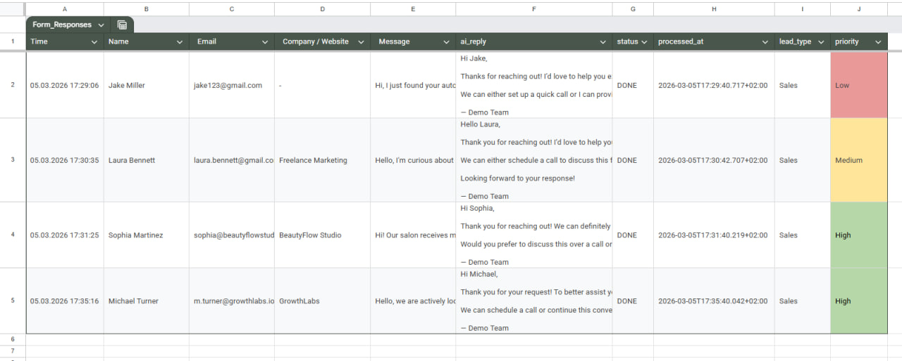

# AI Lead Response Automation with n8n

An n8n automation I built to process incoming leads and help a manager respond faster.

The workflow receives a new request from Google Forms, saves the lead data to Google Sheets, analyzes the message with an LLM and assigns a priority level. The result is then sent to a manager in Telegram together with a suggested response.

## Result

For every incoming request, the workflow stores:

- customer information;
- original message;
- generated reply;
- processing status;
- lead type;
- priority level.

I used **Low / Medium / High** priority levels so that the most important requests could be noticed first.

## How it works

The main flow is:

**Google Forms → n8n → Google Sheets → AI analysis → Telegram**

1. A customer submits a form.
2. n8n receives the lead.
3. The lead is stored in Google Sheets.
4. The message is analyzed with an LLM.
5. A priority level is assigned.
6. A suggested response is generated.
7. The manager receives the result in Telegram.

## Demo

[Watch the demo](demo.mp4)

## Why I built it

I wanted to automate the repetitive part of lead intake.

Instead of manually opening every new request, reviewing it and deciding how urgent it is, the workflow prepares the important information automatically. The final decision still stays with the manager.

## Technologies

- n8n
- OpenAI API
- Google Forms
- Google Sheets
- Telegram Bot API

## Current status

This is a functional prototype.

The workflow was built and tested with sample lead data. The original n8n instance is no longer active, but the repository contains a demo and an example of the processed output.
